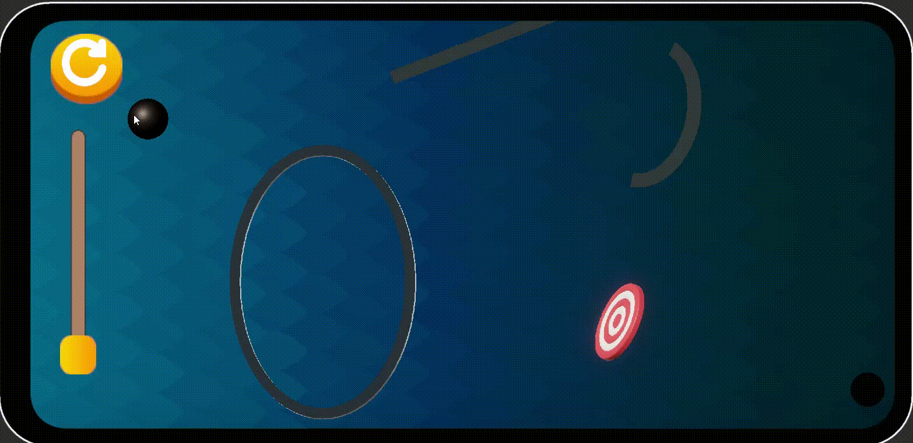

# Ball Throw Task

A mobile-focused Unity physics gameplay prototype developed for the Game Developer Intern technical assignment.

The project is built around a physics-driven projectile mechanic where the player launches a ball using drag input, predicts the trajectory in real time, interacts with curved surfaces and dynamic obstacles, and attempts to reach the target successfully.

The focus of the implementation was to create a clean gameplay architecture with responsive controls, stable physics interaction, modular systems, and polished gameplay feedback.

---

# Gameplay Preview

## GIF / Gameplay Showcase

<p align="center">
  
</p>

---

# Features

- Physics-based projectile launch system
- Mobile drag-and-release controls
- Real-time trajectory prediction
- Dynamic launch force calculation
- Force meter UI
- Curved surface / ramp interaction
- Static and moving obstacles
- Success and failure state handling
- Retry and reset system
- Camera shake and impact feedback
- Procedural-ready level architecture
- Mobile-friendly orthographic gameplay
- Modular manager-based architecture

---

# Controls

## Mobile

- Touch and drag to aim.
- Drag distance controls launch force.
- Drag direction controls launch angle.
- Release touch to launch the ball.

## Editor / PC Testing

- Click and drag with the mouse to aim.
- Release the mouse button to launch.
- Use the Reset button to retry the shot.

---

# Technical Architecture

The project uses a modular gameplay architecture instead of a monolithic single-script implementation.

The codebase is separated into focused gameplay systems to improve readability, maintainability, and scalability.

---

# Implementation Approach

The project was implemented using Unity Rigidbody physics combined with a modular gameplay architecture.

The core gameplay loop works as follows:

1. The player drags on the screen to aim the shot.
2. The drag vector determines both launch force and launch direction.
3. A trajectory preview is generated in real time before launch.
4. On release, velocity is applied to the Rigidbody.
5. The ball then interacts naturally with ramps, obstacles, and targets using Unity physics.
6. Depending on the result, the game transitions into success or failure states.

The gameplay systems were separated into focused components for:
- Input handling
- Trajectory prediction
- Physics launching
- Success/failure handling
- UI and feedback
- Level management

This approach keeps the project scalable and easier to maintain.

---

# Surface Interaction Logic

The game uses Unity Rigidbody physics for interaction with curved surfaces and obstacles.

The ball interacts naturally with ramps and objects through:
- Collision normals
- Impact velocity
- Launch angle
- Surface geometry
- Physics materials

The projectile outcome changes dynamically depending on the player's launch force and direction.

Physics behavior was tuned using:
- Rigidbody velocity-based launching
- Controlled gravity activation
- Continuous collision detection
- Trigger and collider validation
- Physics materials for bounce and friction control

The goal was to keep the gameplay physics-driven while still feeling responsive and predictable.

---

# Success and Failure Handling

The project includes complete success and failure state management.

## Success

The player succeeds when the projectile correctly reaches the target area after being launched.

On success:
- Gameplay input is locked
- Success feedback is triggered
- UI transitions are displayed
- The next level becomes available

## Failure

Failure occurs when:

### FailZone
Triggered when the projectile falls into the designated fail area below the playable level.

### HardImpact
Triggered when the ball collides with an obstacle or surface with excessive impact force, causing the shot to fail.

### MissedCurve
Triggered when the projectile fails to correctly enter or interact with the intended curved ramp/surface.

### TooSlow
Triggered when the projectile loses too much momentum before reaching the target, making the shot invalid.

### OutOfBounds
Triggered when the projectile exits the valid gameplay area or camera bounds.

### Timeout
Triggered when the projectile remains active for too long without reaching a valid success condition.

### Custom
Reserved for additional future failure conditions or scripted gameplay events.

On failure:
- Gameplay input is stopped
- Failure feedback is triggered
- Retry UI is shown
- The level can be restarted

---

# Feedback Systems

To improve gameplay feel and responsiveness, the project includes:

- Real-time trajectory preview
- Dynamic force meter
- Camera shake
- Motion trails
- Success/failure UI feedback
- Screen flash feedback

These systems were designed to improve readability and make the gameplay feel more polished on mobile devices.

---

# Challenges Faced

Some of the major development challenges included:

- Maintaining stable physics behavior across different launch forces
- Matching trajectory prediction with Rigidbody movement
- Preventing generated gameplay objects from spawning outside the camera view (in the brach LevelBuilder)
- Correctly handling trigger/collision-based success and failure logic
- Managing gameplay states cleanly without duplicated transitions
- Balancing responsiveness with realistic physics interaction
- Supporting both mobile touch controls and editor testing

---

# Improvements If Given More Time

Given additional development time, the project could be extended with:

- Should have procedural generation for level building
- Additional moving obstacle types
- Better visual polish and environment art
- Sound effects and audio feedback
- Dynamic level progression
- Scoring and ranking systems
- More advanced launch validation systems
- Additional mobile optimization
- Better procedural difficulty balancing
- Enhanced camera systems using cinemachine 

---

# Project Structure

```text
Assets/
├── Scripts/
│   ├── Projectile/
│   ├── GameManager/
│   ├── Gameplay/
│   ├── UI/
│   ├── Feedback/
│   └── LevelBuilder/  (in the LevelBuilder branch)
├── Prefabs/
├── Materials/
├── Scenes/
└── Art/
```


